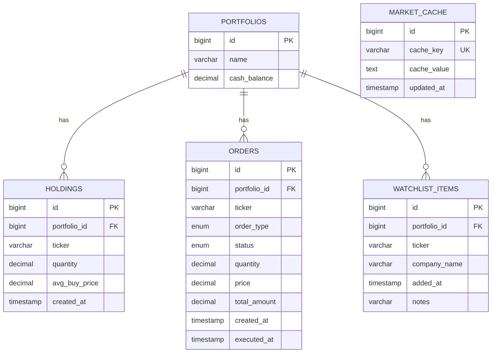

# 📊 Database Documentation

## 1. ER Diagram



---

## 2. Table Definitions

### Table 1: `portfolios`

**Purpose**: Stores user portfolio with cash balance for trading.

```sql
CREATE TABLE portfolios (
    id BIGINT AUTO_INCREMENT PRIMARY KEY,
    name VARCHAR(255) NOT NULL,
    cash_balance DECIMAL(19,4) DEFAULT 100000.0000
);
```

| Column | Type | Constraints | Description |
|--------|------|-------------|-------------|
| id | BIGINT | PRIMARY KEY, AUTO_INCREMENT | Unique identifier |
| name | VARCHAR(255) | NOT NULL | Portfolio name (e.g., "Default Portfolio") |
| cash_balance | DECIMAL(19,4) | DEFAULT 100000 | Available cash for trading |

**Sample Data:**
```
┌────┬────────────────────┬────────────────┐
│ id │ name               │ cash_balance   │
├────┼────────────────────┼────────────────┤
│ 1  │ Default Portfolio  │ 98175.0000     │
└────┴────────────────────┴────────────────┘
```

---

### Table 2: `holdings`

**Purpose**: Stores stocks owned by the user in their portfolio.

```sql
CREATE TABLE holdings (
    id BIGINT AUTO_INCREMENT PRIMARY KEY,
    portfolio_id BIGINT NOT NULL,
    ticker VARCHAR(10) NOT NULL,
    quantity DECIMAL(19,4) NOT NULL,
    avg_buy_price DECIMAL(19,4) NOT NULL,
    created_at TIMESTAMP NOT NULL,
    CONSTRAINT fk_portfolio FOREIGN KEY (portfolio_id) REFERENCES portfolios(id)
);
```

| Column | Type | Constraints | Description |
|--------|------|-------------|-------------|
| id | BIGINT | PRIMARY KEY | Unique identifier |
| portfolio_id | BIGINT | FOREIGN KEY → portfolios.id | Links to portfolio |
| ticker | VARCHAR(10) | NOT NULL | Stock symbol (always uppercase) |
| quantity | DECIMAL(19,4) | NOT NULL | Number of shares owned |
| avg_buy_price | DECIMAL(19,4) | NOT NULL | Average purchase price per share |
| created_at | TIMESTAMP | NOT NULL | When holding was first created |

**Sample Data:**
```
┌────┬──────────────┬────────┬───────────┬───────────────┬─────────────────────┐
│ id │ portfolio_id │ ticker │ quantity  │ avg_buy_price │ created_at          │
├────┼──────────────┼────────┼───────────┼───────────────┼─────────────────────┤
│ 1  │ 1            │ AAPL   │ 10.0000   │ 182.5000      │ 2026-02-04 10:30:00 │
│ 2  │ 1            │ TSLA   │ 5.0000    │ 248.7500      │ 2026-02-04 11:15:00 │
│ 3  │ 1            │ MSFT   │ 3.0000    │ 378.9000      │ 2026-02-04 12:00:00 │
└────┴──────────────┴────────┴───────────┴───────────────┴─────────────────────┘
```

---

### Table 3: `orders`

**Purpose**: Stores all buy/sell order history.

```sql
CREATE TABLE orders (
    id BIGINT AUTO_INCREMENT PRIMARY KEY,
    portfolio_id BIGINT NOT NULL,
    ticker VARCHAR(10) NOT NULL,
    order_type VARCHAR(10) NOT NULL,      -- 'BUY' or 'SELL'
    status VARCHAR(20) NOT NULL,           -- 'PENDING', 'COMPLETED', 'CANCELLED'
    quantity DECIMAL(19,4) NOT NULL,
    price DECIMAL(19,4) NOT NULL,
    total_amount DECIMAL(19,4),
    created_at TIMESTAMP NOT NULL,
    executed_at TIMESTAMP,
    CONSTRAINT fk_order_portfolio FOREIGN KEY (portfolio_id) REFERENCES portfolios(id)
);
```

| Column | Type | Constraints | Description |
|--------|------|-------------|-------------|
| id | BIGINT | PRIMARY KEY | Unique identifier |
| portfolio_id | BIGINT | FOREIGN KEY | Links to portfolio |
| ticker | VARCHAR(10) | NOT NULL | Stock symbol |
| order_type | ENUM | NOT NULL | BUY or SELL |
| status | ENUM | NOT NULL | PENDING, COMPLETED, CANCELLED |
| quantity | DECIMAL(19,4) | NOT NULL | Number of shares |
| price | DECIMAL(19,4) | NOT NULL | Price per share |
| total_amount | DECIMAL(19,4) | - | quantity × price |
| created_at | TIMESTAMP | NOT NULL | When order was placed |
| executed_at | TIMESTAMP | - | When order was executed |

**Sample Data:**
```
┌────┬──────────────┬────────┬────────────┬───────────┬──────────┬─────────┬──────────────┐
│ id │ portfolio_id │ ticker │ order_type │ status    │ quantity │ price   │ total_amount │
├────┼──────────────┼────────┼────────────┼───────────┼──────────┼─────────┼──────────────┤
│ 1  │ 1            │ AAPL   │ BUY        │ COMPLETED │ 10.0000  │ 182.50  │ 1825.0000    │
│ 2  │ 1            │ TSLA   │ BUY        │ COMPLETED │ 5.0000   │ 248.75  │ 1243.7500    │
│ 3  │ 1            │ AAPL   │ SELL       │ COMPLETED │ 2.0000   │ 185.00  │ 370.0000     │
└────┴──────────────┴────────┴────────────┴───────────┴──────────┴─────────┴──────────────┘
```

---

### Table 4: `watchlist_items`

**Purpose**: Stores stocks user is watching (not owned).

```sql
CREATE TABLE watchlist_items (
    id BIGINT AUTO_INCREMENT PRIMARY KEY,
    portfolio_id BIGINT NOT NULL,
    ticker VARCHAR(10) NOT NULL,
    company_name VARCHAR(255),
    added_at TIMESTAMP NOT NULL,
    notes VARCHAR(500),
    CONSTRAINT fk_watchlist_portfolio FOREIGN KEY (portfolio_id) REFERENCES portfolios(id)
);
```

| Column | Type | Constraints | Description |
|--------|------|-------------|-------------|
| id | BIGINT | PRIMARY KEY | Unique identifier |
| portfolio_id | BIGINT | FOREIGN KEY | Links to portfolio |
| ticker | VARCHAR(10) | NOT NULL | Stock symbol |
| company_name | VARCHAR(255) | - | Company name |
| added_at | TIMESTAMP | NOT NULL | When added to watchlist |
| notes | VARCHAR(500) | - | User notes |

**Sample Data:**
```
┌────┬──────────────┬────────┬─────────────────┬─────────────────────┬───────────────────┐
│ id │ portfolio_id │ ticker │ company_name    │ added_at            │ notes             │
├────┼──────────────┼────────┼─────────────────┼─────────────────────┼───────────────────┤
│ 1  │ 1            │ NVDA   │ NVIDIA Corp.    │ 2026-02-04 09:00:00 │ Watch for dip     │
│ 2  │ 1            │ AMD    │ AMD Inc.        │ 2026-02-04 09:15:00 │ Good for long term│
└────┴──────────────┴────────┴─────────────────┴─────────────────────┴───────────────────┘
```

---

### Table 5: `market_cache`

**Purpose**: Stores cached API data (JSON) to reduce external API calls.

```sql
CREATE TABLE market_cache (
    id BIGINT AUTO_INCREMENT PRIMARY KEY,
    cache_key VARCHAR(255) NOT NULL UNIQUE,
    cache_value TEXT,
    updated_at TIMESTAMP
);
```

| Column | Type | Constraints | Description |
|--------|------|-------------|-------------|
| id | BIGINT | PRIMARY KEY | Unique identifier |
| cache_key | VARCHAR(255) | UNIQUE, NOT NULL | Cache identifier |
| cache_value | TEXT | - | JSON string of cached data |
| updated_at | TIMESTAMP | - | Last cache update time |

**Cache Keys Used:**

| cache_key | TTL | Description |
|-----------|-----|-------------|
| `top_gainers` | 5 hours | Top 5 gaining stocks |
| `top_losers` | 5 hours | Top 5 losing stocks |
| `trending_stocks` | 5 hours | 8 trending stocks |
| `market_indices` | 5 hours | S&P 500, NASDAQ, DOW, etc. |
| `market_news` | 1 hour | General market news |
| `stock_news_AAPL` | 1 hour | AAPL-specific news |
| `stock_history_AAPL` | 5 hours | AAPL 5-year history |
| `mutual_funds` | 12 hours | Top mutual funds |

**Sample Data:**
```
┌────┬────────────────────┬───────────────────────────────────────────────┬─────────────────────┐
│ id │ cache_key          │ cache_value (truncated)                       │ updated_at          │
├────┼────────────────────┼───────────────────────────────────────────────┼─────────────────────┤
│ 1  │ top_gainers        │ [{"ticker":"NVDA","name":"NVIDIA Corp.",...}] │ 2026-02-04 09:00:00 │
│ 2  │ top_losers         │ [{"ticker":"PYPL","name":"PayPal",...}]       │ 2026-02-04 09:00:00 │
│ 3  │ market_news        │ [{"title":"Fed Rate Cut","source":"Yahoo"...}]│ 2026-02-04 10:00:00 │
│ 4  │ stock_news_AAPL    │ [{"title":"Apple Q4 Earnings",...}]           │ 2026-02-04 11:00:00 │
└────┴────────────────────┴───────────────────────────────────────────────┴─────────────────────┘
```

---

## 3. Hibernate SQL Queries

### Holdings Queries

```sql
-- GET /api/holdings - Get all holdings
SELECT h1_0.id, h1_0.avg_buy_price, h1_0.created_at, 
       h1_0.portfolio_id, h1_0.quantity, h1_0.ticker 
FROM holdings h1_0;

-- GET /api/holdings/AAPL - Get by ticker
SELECT h1_0.id, h1_0.avg_buy_price, h1_0.created_at, 
       h1_0.portfolio_id, h1_0.quantity, h1_0.ticker 
FROM holdings h1_0 
WHERE h1_0.ticker = ?;

-- POST /api/holdings (create)
INSERT INTO holdings (portfolio_id, ticker, quantity, avg_buy_price, created_at) 
VALUES (?, ?, ?, ?, ?);

-- POST /api/holdings (update)
UPDATE holdings 
SET quantity=?, avg_buy_price=? 
WHERE id=?;

-- DELETE /api/holdings/AAPL
DELETE FROM holdings WHERE ticker=? AND portfolio_id=?;
```

### Orders Queries

```sql
-- GET /api/orders
SELECT o1_0.id, o1_0.created_at, o1_0.executed_at, o1_0.order_type, 
       o1_0.portfolio_id, o1_0.price, o1_0.quantity, o1_0.status, 
       o1_0.ticker, o1_0.total_amount 
FROM orders o1_0 
ORDER BY o1_0.created_at DESC;

-- POST /api/orders
INSERT INTO orders (portfolio_id, ticker, order_type, status, 
                    quantity, price, total_amount, created_at, executed_at) 
VALUES (?, ?, ?, ?, ?, ?, ?, ?, ?);
```

### Portfolio Queries

```sql
-- GET portfolio
SELECT p1_0.id, p1_0.cash_balance, p1_0.name 
FROM portfolios p1_0 
WHERE p1_0.id=?;

-- UPDATE cash balance
UPDATE portfolios 
SET cash_balance=? 
WHERE id=?;
```

### Cache Queries

```sql
-- Check cache
SELECT mc1_0.id, mc1_0.cache_key, mc1_0.cache_value, mc1_0.updated_at 
FROM market_cache mc1_0 
WHERE mc1_0.cache_key=?;

-- Insert cache
INSERT INTO market_cache (cache_key, cache_value, updated_at) 
VALUES (?, ?, ?);

-- Update cache
UPDATE market_cache 
SET cache_value=?, updated_at=? 
WHERE id=?;
```

---

## 4. Table Relationships

```
┌──────────────────────────────────────────────────────────────────────────┐
│                         RELATIONSHIP DIAGRAM                              │
├──────────────────────────────────────────────────────────────────────────┤
│                                                                           │
│                         ┌─────────────────┐                              │
│                         │   PORTFOLIOS    │                              │
│                         │  (id, name,     │                              │
│                         │   cash_balance) │                              │
│                         └────────┬────────┘                              │
│                                  │                                        │
│            ┌─────────────────────┼─────────────────────┐                 │
│            │                     │                     │                 │
│            ▼                     ▼                     ▼                 │
│   ┌─────────────────┐   ┌─────────────────┐   ┌─────────────────┐       │
│   │    HOLDINGS     │   │     ORDERS      │   │ WATCHLIST_ITEMS │       │
│   │ (stocks owned)  │   │ (buy/sell hist) │   │ (stocks watching)│       │
│   └─────────────────┘   └─────────────────┘   └─────────────────┘       │
│                                                                           │
│                         ┌─────────────────┐                              │
│                         │  MARKET_CACHE   │ (standalone - no FK)        │
│                         │  (cached data)  │                              │
│                         └─────────────────┘                              │
│                                                                           │
└──────────────────────────────────────────────────────────────────────────┘
```
