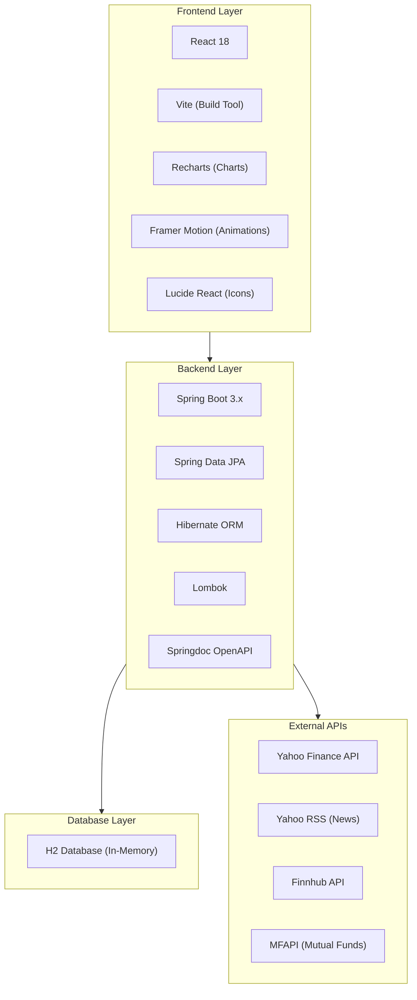
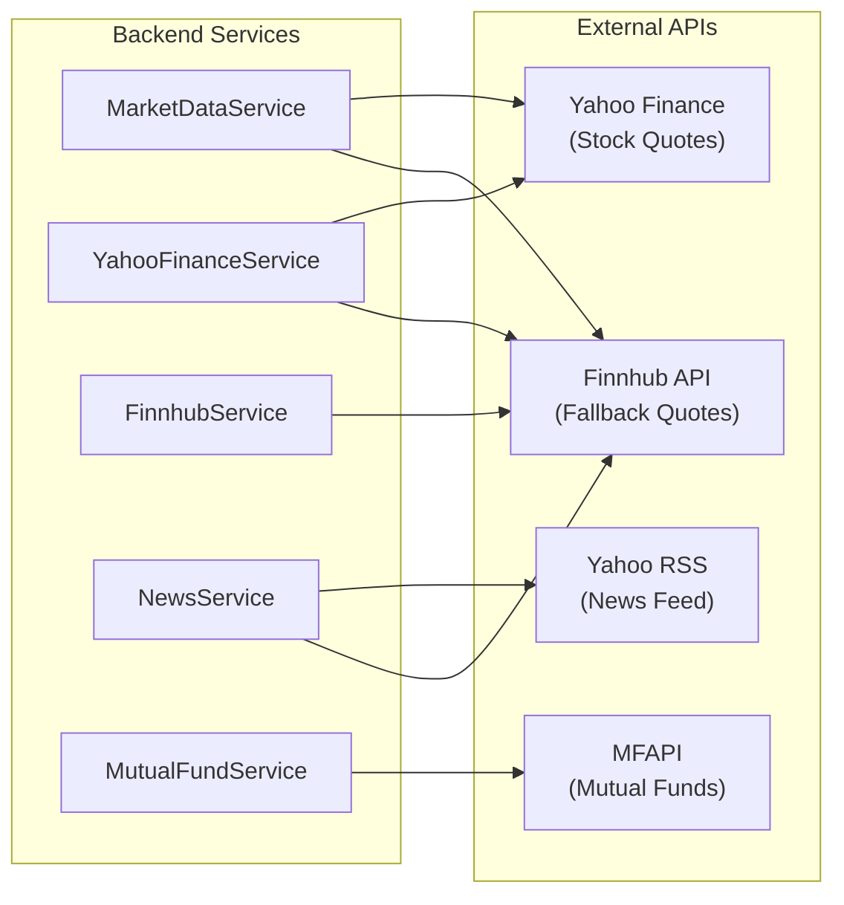
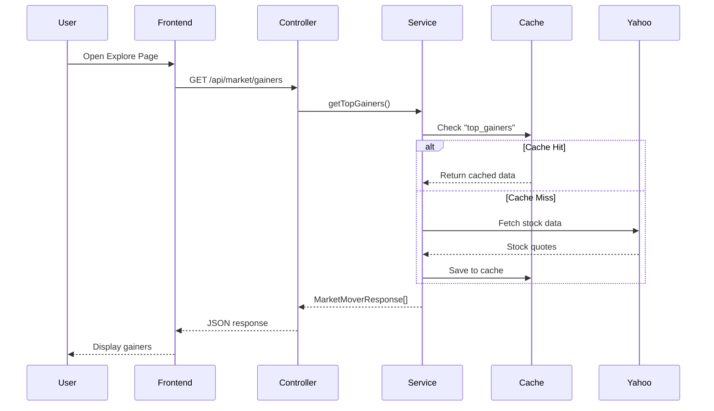
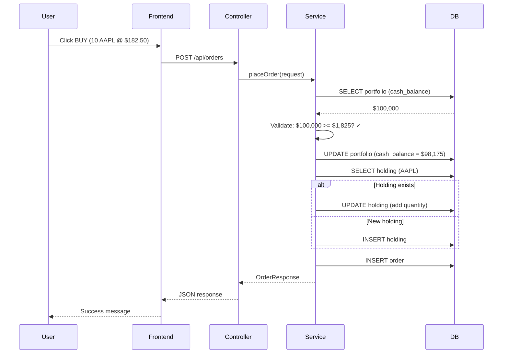
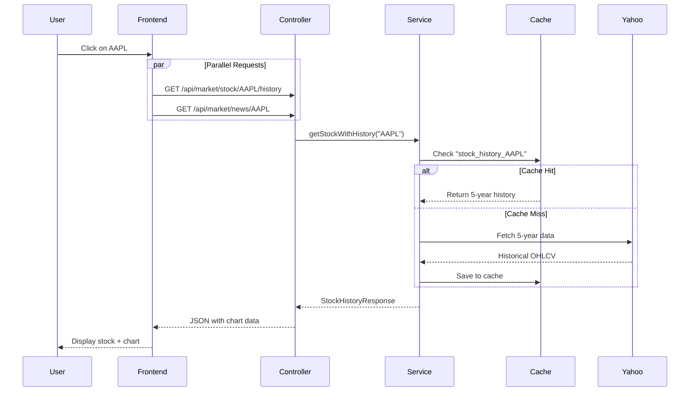

# 🏗️ Project Architecture Documentation

## 1. System Architecture Overview

```
┌─────────────────────────────────────────────────────────────────────────────────────────────────────────┐
│                                    PORTFOLIO MANAGER ARCHITECTURE                                        │
├─────────────────────────────────────────────────────────────────────────────────────────────────────────┤
│                                                                                                          │
│   ┌─────────────────────────────┐                                                                       │
│   │         FRONTEND            │                                                                       │
│   │    (React + Vite)           │                                                                       │
│   │    Port: 5173               │                                                                       │
│   │                             │                                                                       │
│   │  Pages:                     │                                                                       │
│   │  • ExplorePage              │                                                                       │
│   │  • StockDetailPage          │                                                                       │
│   │  • Dashboard                │                                                                       │
│   │  • WalletPage               │                                                                       │
│   │  • OrdersPage               │                                                                       │
│   └──────────────┬──────────────┘                                                                       │
│                  │                                                                                       │
│                  │ HTTP (REST API)                                                                      │
│                  ▼                                                                                       │
│   ┌─────────────────────────────┐                                                                       │
│   │         BACKEND             │                                                                       │
│   │    (Spring Boot 3)          │                                                                       │
│   │    Port: 8080               │                                                                       │
│   │                             │                                                                       │
│   │  Controllers:               │                                                                       │
│   │  • MarketDataController     │◄───────────────────────────────────────────────────────────┐         │
│   │  • HoldingController        │                                                             │         │
│   │  • OrderController          │                         EXTERNAL APIs                       │         │
│   │  • PortfolioController      │                                                             │         │
│   │  • WatchlistController      │         ┌─────────────────────────────────────────────┐    │         │
│   │  • PriceController          │         │                                             │    │         │
│   └──────────────┬──────────────┘         │  ┌─────────────────┐  ┌─────────────────┐  │    │         │
│                  │                         │  │  Yahoo Finance  │  │    Finnhub      │  │    │         │
│                  └─────────────────────────┼─►│  (Stock Data)   │  │  (Fallback)     │◄─┼────┘         │
│                                            │  └─────────────────┘  └─────────────────┘  │              │
│   ┌─────────────────────────────┐         │                                             │              │
│   │        DATABASE             │         │  ┌─────────────────┐  ┌─────────────────┐  │              │
│   │    (H2 In-Memory)           │         │  │   Yahoo RSS     │  │    MFAPI        │  │              │
│   │                             │         │  │   (News)        │  │ (Mutual Funds)  │  │              │
│   │  Tables:                    │         │  └─────────────────┘  └─────────────────┘  │              │
│   │  • portfolios               │         └─────────────────────────────────────────────┘              │
│   │  • holdings                 │                                                                       │
│   │  • orders                   │                                                                       │
│   │  • watchlist_items          │                                                                       │
│   │  • market_cache             │                                                                       │
│   └─────────────────────────────┘                                                                       │
│                                                                                                          │
└─────────────────────────────────────────────────────────────────────────────────────────────────────────┘
```

---

## 2. Technology Stack



---

## 3. Layered Architecture

```
┌────────────────────────────────────────────────────────────────────────────┐
│                            PRESENTATION LAYER                               │
│  ┌──────────────────────────────────────────────────────────────────────┐  │
│  │                         React Frontend                                │  │
│  │                                                                       │  │
│  │   ExplorePage    StockDetailPage    Dashboard    WalletPage           │  │
│  │                                                                       │  │
│  │   Components: MarketPulse, TrendingStocks, NewsSection, etc.          │  │
│  └──────────────────────────────────────────────────────────────────────┘  │
└────────────────────────────────────────────────────────────────────────────┘
                                     │
                                     │ HTTP REST API
                                     ▼
┌────────────────────────────────────────────────────────────────────────────┐
│                              CONTROLLER LAYER                               │
│  ┌──────────────────────────────────────────────────────────────────────┐  │
│  │                      Spring REST Controllers                          │  │
│  │                                                                       │  │
│  │   MarketDataController    HoldingController    OrderController        │  │
│  │   PortfolioController     WatchlistController   PriceController       │  │
│  │                                                                       │  │
│  │   Responsibilities: Request mapping, validation, response formatting  │  │
│  └──────────────────────────────────────────────────────────────────────┘  │
└────────────────────────────────────────────────────────────────────────────┘
                                     │
                                     ▼
┌────────────────────────────────────────────────────────────────────────────┐
│                              SERVICE LAYER                                  │
│  ┌──────────────────────────────────────────────────────────────────────┐  │
│  │                      Business Logic Services                          │  │
│  │                                                                       │  │
│  │   MarketDataService     YahooFinanceService    FinnhubService         │  │
│  │   NewsService           MutualFundService      HoldingService         │  │
│  │   OrderService          PortfolioService       WatchlistService       │  │
│  │   PortfolioAnalyticsService                                           │  │
│  │                                                                       │  │
│  │   Responsibilities: Business logic, caching, external API calls       │  │
│  └──────────────────────────────────────────────────────────────────────┘  │
└────────────────────────────────────────────────────────────────────────────┘
                                     │
                                     ▼
┌────────────────────────────────────────────────────────────────────────────┐
│                            REPOSITORY LAYER                                 │
│  ┌──────────────────────────────────────────────────────────────────────┐  │
│  │                      JPA Repositories                                 │  │
│  │                                                                       │  │
│  │   PortfolioRepository    HoldingRepository    OrderRepository         │  │
│  │   WatchlistRepository    MarketCacheRepository                        │  │
│  │                                                                       │  │
│  │   Responsibilities: Database CRUD operations via Hibernate            │  │
│  └──────────────────────────────────────────────────────────────────────┘  │
└────────────────────────────────────────────────────────────────────────────┘
                                     │
                                     ▼
┌────────────────────────────────────────────────────────────────────────────┐
│                             ENTITY LAYER                                    │
│  ┌──────────────────────────────────────────────────────────────────────┐  │
│  │                      JPA Entities (POJOs)                             │  │
│  │                                                                       │  │
│  │   Portfolio    Holding    Order    WatchlistItem    MarketCache       │  │
│  │                                                                       │  │
│  │   Responsibilities: Database table mapping                            │  │
│  └──────────────────────────────────────────────────────────────────────┘  │
└────────────────────────────────────────────────────────────────────────────┘
                                     │
                                     ▼
┌────────────────────────────────────────────────────────────────────────────┐
│                             DATABASE LAYER                                  │
│  ┌──────────────────────────────────────────────────────────────────────┐  │
│  │                      H2 In-Memory Database                            │  │
│  │                                                                       │  │
│  │   portfolios │ holdings │ orders │ watchlist_items │ market_cache     │  │
│  └──────────────────────────────────────────────────────────────────────┘  │
└────────────────────────────────────────────────────────────────────────────┘
```

---

## 4. Caching Architecture

```
┌─────────────────────────────────────────────────────────────────────────────────┐
│                              CACHING LAYERS                                      │
├─────────────────────────────────────────────────────────────────────────────────┤
│                                                                                  │
│   ┌───────────────────────────────────────────────────────────────────────┐    │
│   │                    LAYER 1: FRONTEND CACHE                             │    │
│   │                    (sessionStorage - 5 min TTL)                        │    │
│   │                                                                         │    │
│   │   Used by: MarketPulse, TrendingStocks, ExplorePage, InvestmentsRibbon│    │
│   │   Purpose: Avoid re-fetching on page navigation                        │    │
│   └───────────────────────────────────────────────────────────────────────┘    │
│                                      │                                          │
│                                      ▼                                          │
│   ┌───────────────────────────────────────────────────────────────────────┐    │
│   │                    LAYER 2: IN-MEMORY CACHE                            │    │
│   │                    (ConcurrentHashMap - 5 min TTL)                     │    │
│   │                                                                         │    │
│   │   Used by: YahooFinanceService (price caching)                         │    │
│   │   Purpose: Avoid repeated API calls for same stock in short period    │    │
│   └───────────────────────────────────────────────────────────────────────┘    │
│                                      │                                          │
│                                      ▼                                          │
│   ┌───────────────────────────────────────────────────────────────────────┐    │
│   │                    LAYER 3: DATABASE CACHE                             │    │
│   │                    (market_cache table - variable TTL)                 │    │
│   │                                                                         │    │
│   │   Cache Keys:           TTL:                                            │    │
│   │   • top_gainers         5 hours                                         │    │
│   │   • top_losers          5 hours                                         │    │
│   │   • trending_stocks     5 hours                                         │    │
│   │   • market_indices      5 hours                                         │    │
│   │   • market_news         1 hour                                          │    │
│   │   • stock_news_*        1 hour                                          │    │
│   │   • stock_history_*     5 hours                                         │    │
│   │   • mutual_funds        12 hours                                        │    │
│   └───────────────────────────────────────────────────────────────────────┘    │
│                                                                                  │
└─────────────────────────────────────────────────────────────────────────────────┘
```

---

## 5. External API Integration



### External API Details

| API | Base URL | Auth | Used For |
|-----|----------|------|----------|
| **Yahoo Finance** | (Java Library) | None | Stock quotes, historical data |
| **Yahoo RSS** | finance.yahoo.com/rss | None | Market news, stock news |
| **Finnhub** | finnhub.io/api/v1 | API Key | Fallback quotes, company news |
| **MFAPI** | api.mfapi.in/mf | None | Indian mutual funds |

---

## 6. Data Flow Diagrams

### 6.1 User Views Explore Page



### 6.2 User Places Buy Order



### 6.3 Stock Detail Page Load



---

## 7. Component Interaction Diagram

```
┌──────────────────────────────────────────────────────────────────────────────────┐
│                           COMPONENT INTERACTIONS                                  │
├──────────────────────────────────────────────────────────────────────────────────┤
│                                                                                   │
│   Frontend Components                Backend Services              External APIs  │
│   ────────────────────              ────────────────              ─────────────  │
│                                                                                   │
│   ┌─────────────────┐               ┌─────────────────┐          ┌──────────────┐│
│   │ ExplorePage     │──────────────►│MarketDataService│─────────►│Yahoo Finance ││
│   │                 │               │                 │          └──────────────┘│
│   │ • MarketPulse   │               │ • getTopGainers │                          │
│   │ • TrendingStocks│               │ • getTopLosers  │          ┌──────────────┐│
│   │ • NewsSection   │               │ • getTrending   │─────────►│ Finnhub API  ││
│   └─────────────────┘               │ • searchStocks  │          └──────────────┘│
│                                     └─────────────────┘                          │
│                                                                                   │
│   ┌─────────────────┐               ┌─────────────────┐          ┌──────────────┐│
│   │ StockDetailPage │──────────────►│  NewsService    │─────────►│  Yahoo RSS   ││
│   │                 │               │                 │          └──────────────┘│
│   │ • Stock info    │               │ • getNews       │                          │
│   │ • Price chart   │               │ • getStockNews  │          ┌──────────────┐│
│   │ • News section  │               └─────────────────┘─────────►│Finnhub News  ││
│   │ • Buy/Sell      │                                            └──────────────┘│
│   └─────────────────┘                                                            │
│                                                                                   │
│   ┌─────────────────┐               ┌─────────────────┐                          │
│   │ Dashboard       │──────────────►│PortfolioAnalytics│                         │
│   │                 │               │                 │                          │
│   │ • Summary       │               │ • getSummary    │                          │
│   │ • Holdings      │               └─────────────────┘                          │
│   │ • P&L           │                       │                                    │
│   └─────────────────┘                       ▼                                    │
│                                     ┌─────────────────┐                          │
│                                     │YahooFinanceServ │                          │
│                                     │                 │                          │
│                                     │ • getStockPrice │                          │
│                                     └─────────────────┘                          │
│                                                                                   │
│   ┌─────────────────┐               ┌─────────────────┐                          │
│   │ WalletPage      │──────────────►│ OrderService    │                          │
│   │                 │               │                 │                          │
│   │ • Balance       │               │ • placeOrder    │                          │
│   │ • Transactions  │               │ • getAllOrders  │                          │
│   └─────────────────┘               └─────────────────┘                          │
│                                             │                                    │
│                                             ▼                                    │
│                                     ┌─────────────────┐                          │
│                                     │ HoldingService  │                          │
│                                     │                 │                          │
│                                     │ • getAllHoldings│                          │
│                                     │ • create/update │                          │
│                                     └─────────────────┘                          │
│                                                                                   │
└──────────────────────────────────────────────────────────────────────────────────┘
```

---

## 8. Request-Response Flow

```
┌─────────────────────────────────────────────────────────────────────────────────┐
│                         REQUEST → RESPONSE FLOW                                  │
├─────────────────────────────────────────────────────────────────────────────────┤
│                                                                                  │
│   1. HTTP REQUEST                                                                │
│      GET /api/market/gainers                                                     │
│              │                                                                   │
│              ▼                                                                   │
│   ┌──────────────────────┐                                                      │
│   │  DispatcherServlet   │  (Spring MVC entry point)                            │
│   └──────────┬───────────┘                                                      │
│              │                                                                   │
│              ▼                                                                   │
│   ┌──────────────────────┐                                                      │
│   │ MarketDataController │  @GetMapping("/gainers")                             │
│   │ getTopGainers()      │                                                      │
│   └──────────┬───────────┘                                                      │
│              │                                                                   │
│              ▼                                                                   │
│   ┌──────────────────────┐                                                      │
│   │  MarketDataService   │  getTopGainers() → getCachedOrFetch()                │
│   └──────────┬───────────┘                                                      │
│              │                                                                   │
│       ┌──────┴──────┐                                                           │
│       ▼             ▼                                                           │
│   [Cache Hit]  [Cache Miss]                                                     │
│       │             │                                                           │
│       │      ┌──────┴──────┐                                                    │
│       │      ▼             ▼                                                    │
│       │  [Yahoo API]  [Finnhub API]                                             │
│       │      │             │                                                    │
│       │      └──────┬──────┘                                                    │
│       │             ▼                                                           │
│       │      [Save to Cache]                                                    │
│       │             │                                                           │
│       └──────┬──────┘                                                           │
│              │                                                                   │
│              ▼                                                                   │
│   ┌──────────────────────┐                                                      │
│   │ ResponseEntity<>     │  HTTP 200 OK                                         │
│   │ [MarketMoverResponse]│                                                      │
│   └──────────┬───────────┘                                                      │
│              │                                                                   │
│              ▼                                                                   │
│   2. JSON RESPONSE                                                               │
│      [{"ticker":"NVDA","name":"NVIDIA","price":682.35,...}]                     │
│                                                                                  │
└─────────────────────────────────────────────────────────────────────────────────┘
```

---

## 9. Project Directory Structure

```
portfolio-manager/
├── Frontend/                          # React Frontend
│   ├── public/
│   ├── src/
│   │   ├── api/                       # API service calls
│   │   │   └── api.js
│   │   ├── components/                # Reusable components
│   │   │   ├── InvestmentsRibbon.jsx
│   │   │   ├── MarketPulse.jsx
│   │   │   ├── NewsSection.jsx
│   │   │   ├── SearchBar.jsx
│   │   │   └── TrendingStocks.jsx
│   │   ├── pages/                     # Page components
│   │   │   ├── Dashboard.jsx
│   │   │   ├── ExplorePage.jsx
│   │   │   ├── StockDetailPage.jsx
│   │   │   └── WalletPage.jsx
│   │   ├── App.jsx
│   │   └── main.jsx
│   ├── package.json
│   └── vite.config.js
│
├── src/main/                          # Spring Boot Backend
│   ├── java/com/portfolio/manager/
│   │   ├── PortfolioManagerApplication.java
│   │   ├── config/
│   │   ├── controller/
│   │   ├── dto/
│   │   ├── entity/
│   │   ├── exception/
│   │   ├── repository/
│   │   └── service/
│   └── resources/
│       └── application.properties
│
├── src/test/                          # JUnit Tests
│   └── java/com/portfolio/manager/
│       ├── PortfolioManagerApplicationTests.java
│       ├── controller/
│       └── service/
│
└── pom.xml                            # Maven dependencies
```

---

## 10. Scheduled Tasks

| Task | Cron Expression | Purpose |
|------|-----------------|---------|
| `refreshAllCaches()` | Every 5 hours | Refresh market data caches |

```java
@Scheduled(initialDelay = 18000000, fixedRate = 18000000)  // 5 hours
public void refreshAllCaches() {
    updateCache("top_gainers", fetchTopGainers());
    updateCache("top_losers", fetchTopLosers());
    updateCache("trending_stocks", fetchTrendingStocks());
    updateCache("market_indices", fetchMarketIndices());
}
```
